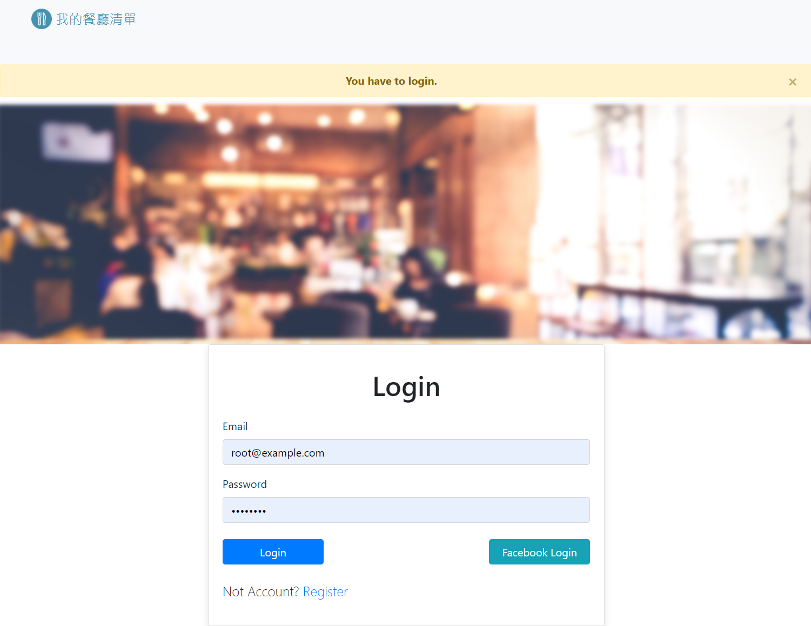
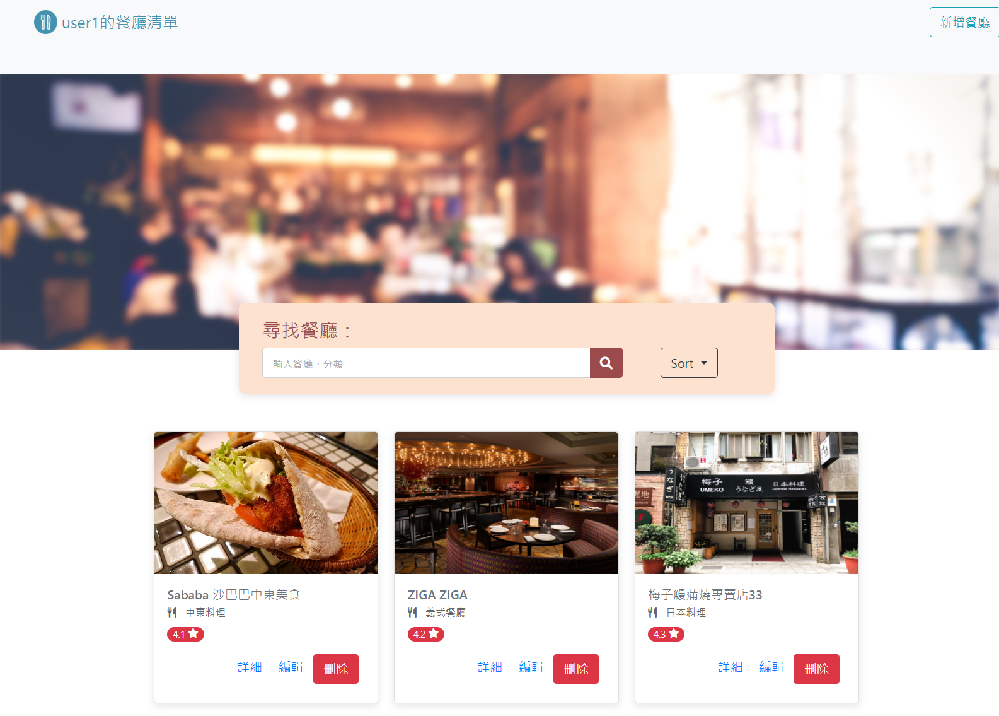

# 餐廳清單網頁

這是一個使用 express 與 Node.js 打造的餐廳網頁  
使用者可以註冊自己的帳號來登入使用，或是以 Facebook 登入使用

使用者可以查看自己的餐廳詳細資料，以及新增、編輯、刪除、搜尋想要的餐廳名稱或種類

## Images 網頁圖片




### Installing 安裝流程

先將此專案 Clone 到主機的資料夾

```
git clone https://github.com/PaulChen79/AlphaCamp-Restaurant-List-Assignment.git
```

在下載的資料夾底下安裝 dependencies

```
npm install
```

下載完成後新增一個.env，放入 MONGODB_URI，連結你的 mongoBD

```
MONGODB_URI = mongodb+srv://<你的mongoDB帳號>:<你的mongoDB密碼>@cluster0.xxxx.xxxx.net/<你的MongoDB Table><?retryWrites=true&w=majority
```

連結完成後使用以下 command 生成種子資料

```
npm run seed
```

種子資料會有 2 個 user 資料：

```
{
		name: 'user1',
		email: 'user1@example.com',
		password: '12345678'
	},
	{
		name: 'user2',
		email: 'user2@example.com',
		password: '12345678'
	}
```

種子資料完成後執行 add.js 檔案

```
npm start
```

如果 ternimal 有出現 "Server is running on port 3000" 字樣，即可在 http://localhost:3000 看到此網頁

## Features 功能

-首頁可以瀏覽餐廳簡單資訊  
-點擊餐廳圖片可以瀏覽詳細資訊，以及 google map 連結  
-可以搜尋想要的餐廳名稱及類別  
-可以新增自己想要的餐廳  
-可以編輯餐廳的詳細資訊  
-可以刪除你想刪除的餐廳  
-可以使用 Sort 功能去排序餐廳頁面

## Dependencies 使用套件

Node.js v4.16.0  
express  
express-handlebars  
express-session  
connect-flash  
dotenv  
method-override  
mongoose  
modemon  
valid-uri  
passport  
bycryptjs

## Contributor 開發人員

Pin Hsu Chen & AC
